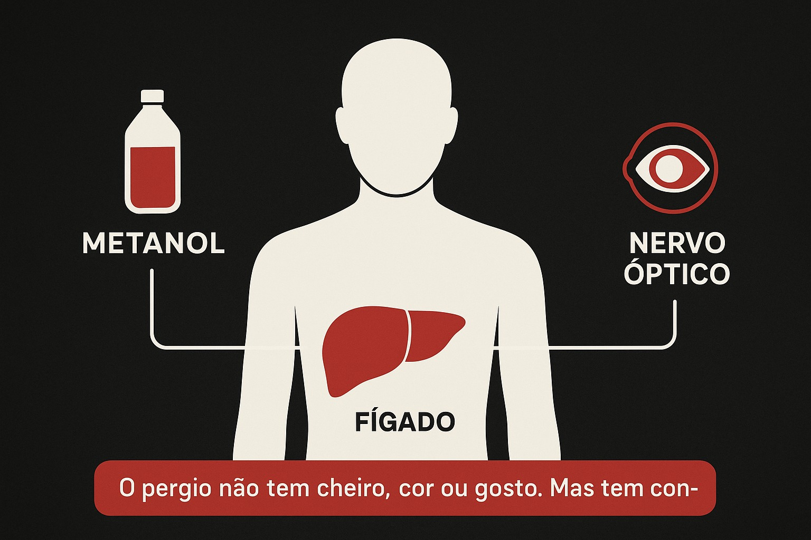
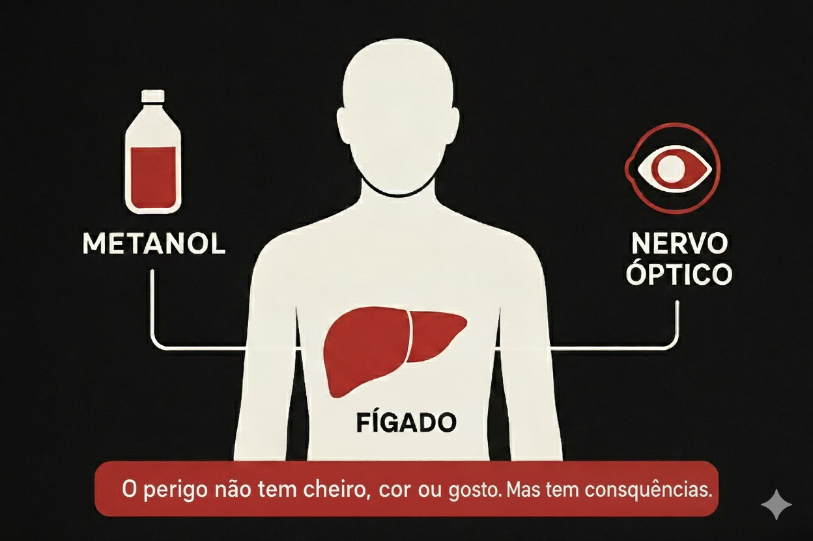
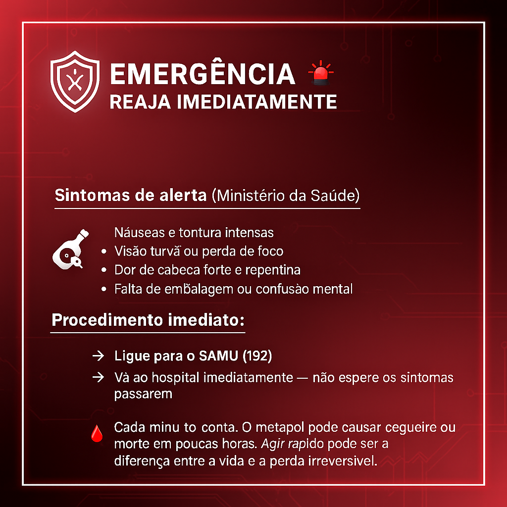
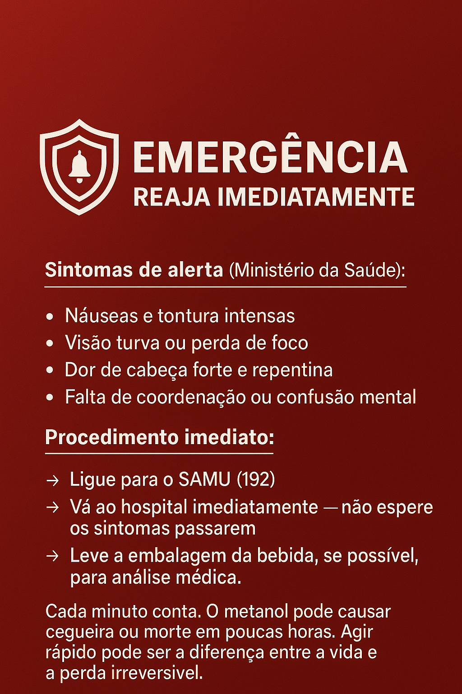

# 🖼️ ANEXO: Crítica às IA Generativas de Imagem  

### O Fenômeno das Alucinações Visuais em IA

Ao ler o ebook [**Metanol: o perigo invisível**](https://github.com/apedrodev1/prompts-recipe-to-create-a-ebook/blob/main/Metanol%20o%20perigo%20invis%C3%ADvel%20-%20ebook.pptx), é possível perceber erros graves de português nas imagens — especialmente em legendas, rótulos e avisos de perigo.  
Essas falhas não são descuido do autor, mas sim **exemplo real das limitações das atuais IAs generativas**.  
Mesmo com prompts bem definidos e revisões manuais, os modelos ainda apresentam **"alucinações visuais"**, isto é, textos incorretos, distorções de grafia e inconsistências contextuais, principalmente em **idiomas fora do eixo inglês**.  

Este anexo busca **documentar e comparar** esses erros, apresentando um pequeno estudo de caso sobre **como as camadas de acesso (gratuita, paga e corporativa)** afetam a **coerência e a legibilidade das imagens geradas**.

---

## 📊 Comparativo de Qualidade

**Mesmo prompt em diferentes camadas de uso:**

| Camada        | Resultado do Texto em Português                      | Coerência Visual                        |
|----------------|------------------------------------------------------|-----------------------------------------|
| **Free**       | "Bbedida alcolica perigosa"                          | Elementos distorcidos e ilegíveis       |
| **US$ 10/mês** | "Bebida alcoólica perigosa"                          | Melhor, mas ainda com erros tipográficos |
| **Enterprise** | "Bebida alcoólica adulterada — risco à saúde"        | Coerência perfeita entre texto e imagem  |

---

## 📸 Caso Prático: A Evolução de uma Imagem com Erros  

**Prompt usado:** `"Gere uma imagem representando os riscos do metanol para o nosso fígado e nervo óptico. Com a seguinte mensagem: "O perigo não tem cheiro, cor ou gosto. Mas tem consequências!"`

### 🔹 Imagem Original (DALL·E 3)

**Problemas identificados:**
- Texto em português completamente sem sentido  
- Tipografia aleatória e ilegível  
- Elementos visuais fora de contexto  

---

### 🔹 Tentativa de Refinamento (Gemini Nano Banano)
**Correção proposta:** “Corrigir texto em português no rodapé:”  
**Prompt usado:** `"Corrigir a mensagem no rodapé da imagem. Segue o texto correto: ""O perigo não tem cheiro, cor ou gosto. Mas tem consequências!""`

📎 **Imagem Resultante:**  

**Resultados observados:**
- Texto ainda com erros ortográficos  
- Perda de nitidez da imagem original  
- Persistência da alucinação já no primeiro prompt  

---

## 🔄 Ivertendo o processo: 

**Prompt usado:** 

`"Gere um card com a seguinte mensagem: "EMERGÊNCIA: REAJA IMEDIATAMENTE Sintomas de alerta (Ministério da Saúde): Náuseas e tontura intensas Visão turva ou perda de foco Dor de cabeça forte e repentina Falta de coordenação ou confusão mental Procedimento imediato: Ligue para o SAMU (192) Vá ao hospital imediatamente — não espere os sintomas passarem Leve a embalagem da bebida, se possível, para análise médica. Cada minuto conta. O metanol pode causar cegueira ou morte em poucas horas. Agir rápido pode ser a diferença entre a vida e a perda irreversível."`

### 🔹 Imagem Original (Gemini Nano Banano)

**Problemas identificados:**
- Texto em português completamente sem sentido  
- Tipografia aleatória e ilegível  
- Elementos visuais fora de contexto  

---

### 🔹 Tentativa de Refinamento (DALL·E 3)
**Correção proposta:** “Corrigir texto em português na imagem:”  

**Prompt usado:** 

`"Corrigir a mensagem da imagem. Segue o texto correto: "EMERGÊNCIA: REAJA IMEDIATAMENTE Sintomas de alerta (Ministério da Saúde): Náuseas e tontura intensas Visão turva ou perda de foco Dor de cabeça forte e repentina Falta de coordenação ou confusão mental Procedimento imediato: Ligue para o SAMU (192) Vá ao hospital imediatamente — não espere os sintomas passarem Leve a embalagem da bebida, se possível, para análise médica. Cada minuto conta. O metanol pode causar cegueira ou morte em poucas horas. Agir rápido pode ser a diferença entre a vida e a perda irreversível.""`

📎 **Imagem Resultante:**  

**Resultados observados:**
- Texto ainda com erros ortográficos, porém com uma grande melhora em relação a imagem inicial. 
- Perda de elementos gráficos (logo de alerta no inicio da página) 

### 🔹 Segunda Tentativa de Refinamento:
**Prompt usado:** 
`"Refine novamente. Segue o texto: ... "`

📎 **Imagem Resultante:**  

**Resultados observados:**
- Erros ortográficos corrigidos,
- Perda de todo o layout da imagem inicial; ele ainda preserva as cores e faz uma representação melhor ao sino de alerta, comparado a segunda imagem.

 

> ℹ️ **NOTE:** Aqui entramos em um loop de alucinações e neste ponto dificilmente voltaremos a imagem inicial. A recomendação é abortar o processo, re-avaliar os prompts já utilizados e reinicia-lo novamente.

---

 

## 🧠 Análise Técnica do Problema
### Limitações Identificadas:

- Compreensão Linguística Superficial

- IAs tratam texto em imagens como elementos visuais, não semânticos

- Reconhecem "formas de letras", não significado

- Incapacidade de Auto-correção Contextual

- Mesmo com prompts específicos, não conseguem validar a precisão do texto gerado

- Criam novas alucinações ao tentar corrigir as anteriores

- Viés Cultural e Linguístico

- Treinamento predominantemente em inglês

- Pouco entendimento de nuances do português brasileiro

 

## 💰 A Economia da Qualidade: Capitalização dos Recursos
### A Hierarquia de Acesso por Pagamento:

#### **🔴 Camada Free/Estudante:**

- Processamento limitado e deliberadamente inferior,

- Alucinações mais frequentes e correções intencionalmente mitigadas,

- "Amostra grátis" que mais frustra do que ajuda,

- Textos em português consistentemente piores que versões pagas.

#### **🟡 Camada Básica (Low-tier paid):**

- Melhorias marginais, suficientes para criar dependência,

- Acesso a correções que deveriam ser básicas,

- Continuam omitindo capacidades de processamento importantes da IA.

#### **🟢 Camada Premium/Enterprise:**

- Processamento prioritário e algoritmos "completos"

- Menos alucinações, melhor compreensão contextual

- Recursos de correção que funcionam adequadamente

 

## 🎯 Lições Aprendidas no Processo
### O que funcionou:

- IAs são eficientes para conceitos visuais abstratos

- Boas para criar atmosfera e elementos gráficos não-textuais

- O que não funcionou:

- Geração de texto preciso em português

- Manutenção de consistência em refinamentos

- Correção de erros específicos

## 🔧 Recomendações para Futuros Projetos
### Estratégias de Mitigação:

- Evitar texto em imagens quando usar IAs gratuitas

- Usar ferramentas especializadas como Canva para adicionar texto posteriormente

- Validar sempre com revisão humana antes da publicação final

- Considerar ilustrações sem texto como solução mais segura

 

## 💡 Reflexão Final

### A Dupla Dependência: Humana e Financeira
As IAs generativas não são apenas adolescentes tecnológicas - são adolescentes com preço de entrada. E como qualquer jovem mimado, seu desempenho está diretamente ligado ao quanto você pode pagar por sua atenção.

 

### 💰 A Realidade Econômica das Nossas Ferramentas
#### Descobrimos que qualidade tem preço, e ele é salgado:

- Versões gratuitas: alucinam mais do que ajudam

- Versões estudantis: oferecem migalhas de capacidade real

- Versões premium: cobram caro pelo que deveria ser básico

**O maior insight deste apêndice: é que as limitações não são apenas técnicas - são estratégicas. As empresas criam problemas artificiais para vender soluções caras.**

 

### 🛡️ A Dupla Proteção Necessária
#### 1. Proteção Contra as Alucinações Técnicas

    - Revisão humana como filtro contra absurdos

    - Validação de cada informação gerada

    - Checagem de coerência e precisão

 

#### 2. Proteção Contra as Alucinações Comerciais

    - Consciência de que versões free são "produtos capados"

    - Entendimento que pagar mais não elimina necessidade de revisão

    - Reconhecimento que mesmo IAs caras ainda precisam de supervisão

 

### 🔮 O Futuro que Nos Espera
#### Daqui a 5, 10, 15 anos...

- As IAs ficarão mais inteligentes, mas também mais caras

- As alucinações ficarão mais sutis, portanto mais perigosas

- A necessidade de supervisão humana não diminuirá - se transformará

- O papel humano evolui de "corretor de erros" para:

    - Curador de ética em sistemas cada vez mais autônomos

    - Guardião de veracidade em meio a alucinações sofisticadas

    - Defensor da acessibilidade contra modelos de negócio excludentes

 

### 💡 A Lição que Levaremos Para Frente
#### Trabalhar com IA generativa é como lidar com bebidas adulteradas:

- As versões gratuitas são como bebidas de balada - baratas, mas perigosas

- As versões premium são como licores importados - caros, mas ainda intoxicantes

- A única proteção real é o paladar humano treinado

- Este projeto nos ensinou que não basta alertar sobre falsificações no mundo físico - precisamos igualmente alertar sobre falsificações de capacidade no mundo digital.

 

---
 

*Última revisão humana em 08/03/2024 - porque alguma inteligência precisa ser real.*

