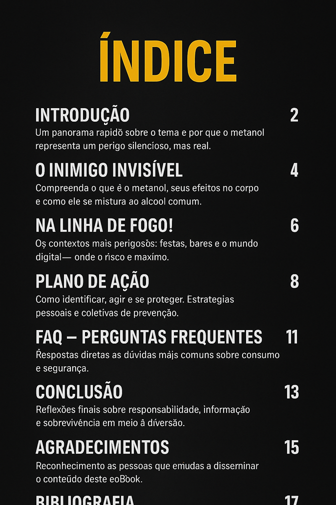

## 🧠 Prompts - Desenvolvimento da imagem do índice.

## [GPT - DALLE 3](https://chatgpt.com/)：

|   Ação   | Prompt |
| :------: | ------------------------------------------------------------------------------------------------------------------------------------------------------------------------------------------------------------------------------------------------------------------------------ |
| Criação da imagem do index | Gere uma imagem de índice, com fundo escuro, tipografia limpa e títulos destacados em amarelo ou branco.  Formato de saída: tamanho A3.  ÍNDICE  2. Introdução 4. O Inimigo Invisível — Compreenda o que é o metanol, seus efeitos no corpo e como ele se mistura ao álcool comum. 6. Na Linha de Fogo! — Os contextos mais perigosos: festas, bares e o mundo digital — onde o risco é máximo. 8. Plano de Ação — Como identificar, agir e se proteger. Estratégias pessoais e coletivas de prevenção. 11. FAQ — Perguntas Frequentes. Respostas diretas às dúvidas mais comuns sobre consumo e segurança. 13. Conclusão — Reflexões finais sobre responsabilidade, informação e sobrevivência em meio à diversão. 15. Call to Action — O que você pode fazer agora para ajudar a disseminar o alerta e salvar vidas. 16. Agradecimentos — Reconhecimento às pessoas que ajudaram de alguma maneira na criação deste Ebook. 17. Bibliografia — Fontes, Referências e Leitura Recomendada.  |

 
 

| Resposta | Visualização |
| :------: | ------------------------------------------------------------------------------------------------------------------------------------------------------------------------------------------------------------------------------------------------------------------------------ |
| Resultado | 

 |

 

> ℹ️ **NOTE:** A imagem apresenta alta precisão e fidelidade na reprodução dos elementos alfanuméricos do prompt, com acerto notável na formatação e na disposição textual, porém não segue ou não entende a segmentação de páginas, solicitada.
E se observa uma alucinação no formato de saída, resultando em corte parcial do conteúdo, com a imagem interrompendo-se antes da seção Bibliografia, deixando alguns elementos ausentes.

